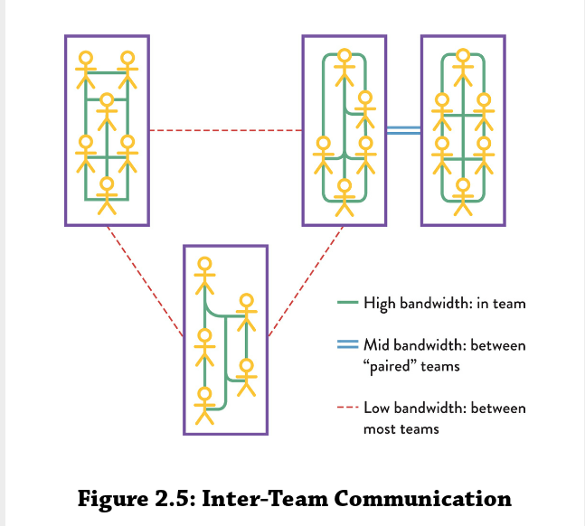

- Does checkout have issues with delivering value (via features in apps) because of poor team design

# Team Topologies Organizing Business and Technology Tams for Fast Flow

## Chapter 1 - The Problem with Org Charts

- Need to shift thinking
    - From: treating teams as collections of interchangeable individuals that will succeed as long as they follow the "right" process and use the "right" tools
    - To: treating people and technology as a single thing
- Need to ensure teams are intrinsically (aka self) motivated and given a real chance of doing their best work within such a system

### Communication Structures of an Organization

- Most organizations want or are required to have a single view of their teams and people called the "org chart"
- This chart depicts the teams, departments, units, and other organizational entities and how they relate to one another

 

- Using the org chart as main mechanism for splitting the work to be done leads to unrealisitic expectations
- Org charts, at face value, are supposed to map communication within the lines of the org chart
- People don't actually restrict themselves to only talking to people within their org chart

 

- In reality, people communication laterally or "horizontally" to get work done
    - This creativity and problem solving needs to be nurtured for the benefit of the organization
    - No reason to restrict to top-down/buttom-uup communication and reporting

### Org Chart Thinking Is the Problem

- Orgs need to develop more realisitic pictures of the expected and actual communication happening between teams an individuals
- Decisions based on org-chart structure tend to optimize for only part of the organization
    - Local optimizations help the teams directly involved, but they don't necessarily help improve the overall delivery of value to customers
    - Impact may be negligible if there are larger bottlenecks in the stream of work
        - For example, having teams adopt cloud and infrastructure-as-code can reduce the time to provision new infrastructure from weeks or months to minutes or hours
        - But if every change requires deployment approval from a board that meets once a week, then delivery speed will remain weekly at best

 

- Systems thinking focuses on optimizing for the whole, looking at the overall flow of work, identifying what the largest bottleneck is today, and eliminating it
    - Repeat this over and over

 

- Thinking of the org chart as a faithful representation of how work gets done and how teams interact with each other leads to ineffective decisions around allocation of work and responsibilities
- Org chart is always out of sync with relaity just like a software architecture document gets outdated as soon as the actual software development starts

### Beyond the Org Chart

- 3 different organizational structures in every oganization
    1. Formal structure (the org chart) - facilitates compliance
    1. Informal structure - the "realm of influence" between individuals
    1. Value creation structure - how work actually gets done on inter-personal and inter-team reputation

 

- Key to successful knowledge work organizations is in the interactions between the informal structure and the value creation structure (interactions between people and teams)
- By empowering teams, and treating them as fundamental building blocks, individuals inside those teams move closer together to act as a team rather than just a group of people
- By explicitly agreeing on interaction modes with other teams, expectations on behaviors becomes clearer and inter-team trust grows

### Team Topologies: A New Way of Thinking about Teams

- 4 fundamental team types
    - stream-aligned
    - platform
    - enabling
    - complicated-subsystem
- 3 core team interaction modes
    - collaboration
    - X-as-a-Service
    - facilitating

 

- Team Topologies looks at ways in which different topologies can evolve with technological and organizational maturity
    - Periods of technical and product discovery typically require a highly collaborative environment (with overlapping team boundaries) to succeed
    - Keeping that same structure when discovery is over (you have established technologies and product) can lead to wasted effort and misunderstandings

 

- By emphasizing an adaptive model for organization design and actively prioritizing the interrelationship of teams, the Team Topologies approach provides a mechanism for enterprises to sense when a change in strategy is required (either from a business or technology viewpoint)
- End goal is to help teams produce software that aligns with customer needs and is easier to build, run, and own

### The Revival of Conway's Law

- `Organizations which design systems are constrained to produce designs which are copies of the communication structures of these organizations`

### Key Takeaways

- Conway's law suggests major gains from designing software architecture and team interactions together, since they are similar forces
- Building software requires an understanding of communication across teams in order to realistically consider what kind of software architectures are feasible
    - If the desired theortical system architecture does not fit the organizational model, then one of the two will need to change (either the system architecture or the organizational model)
- `Team structures must match the required software architecture or risk producing unintended designs`

 

- Revival of Conway's law took place around 2015 when the microservices architectures were on the rise
- `Inverse Conway Maneuver`
    - Organization focuses on organizing team structures to match the architecutre they want to exhibit
    - This is in contract to expecting teams to follow a mandated architecture design

 

- Key takeway here is that thinking of software architecture as a standalone concept that can be designed in isolation and then implemented by any group of teams is fundamentally wrong
- This gap between architecture and team structure is visible across all types of architectures, from client-server to SOA and even microservices
- This is why monoliths need to be broken down (more on this in Chapter 6)

### Cognitive Load and Bottlenecks

- Any one person has a limit on ow much information they can hold in their brains at any given moment
- The same thing happens for one team

 

- Cognitive load when assigning responsibilities or software parts to a given team is hardly discussed
- Teams are spread thin trying to cover an excessive amount of responsibilities and domains
- These teams lack bandwidth to pursue mastery of their trade and struggle with costs of switching contexts

 

- Ex: Engineering Productivity team's mission was to help product teams run their builds efficiently, maintain infrastructure, and improve test execution
    - Team kept growing and took on extra responsibilities are CI, CD, and infrastructure automation
    - Sprint planning became a mix and match of requests across their stack of responsibilities
    - Prioritization was hard and frequent context switching even through a single sprint let to a dip in people's motivation
    - Not surprising considering 3 elements of intrinsic motivation
        - 3 elements of intrinsic motivation
            - Autonomoy
            - Mastery
            - Purpose

 

- The number of services and components for which a product team is responsible (in other words, demand on the team) typically grows over time
- Development of new services is often planned as if the team had full time availability and zero cognitive load to start with
- This neglect is problematic b/c team is still required to fix and enhance existing services
- Ultimately, the team becomes a delivery bottleneck, as their cognitive capacity has been largely exceeded, leading to delays, quality issues, and often, a decrease in team members' motivations

 

- Explicitly thinking about cognitive load can be a powerful tool for deciding on a team size, assigning responsibilities, and establishing boundaries with other teams

 

- Team Topologies approach advocates for organization design that optimizes for *flow of change* and feedback from running systems
- This requires restricting cognitive load on teams and explicitly desining the intercommunications between teams to help produce the software systems architecture that we need

### Summary: Rethink Team Structures, Purpose, and Interactions

- Historically software develoment was seen as a type of manufacturing to be completed by separate individuals arranged into functional specialities, which large projects planned up front
- This lead to problems like:
    - Pushing against Conway's law
    - Disengaged teams
    - Software Too Big for Teams
    - Confusing Org Design Options
    - Team Pulled in Many Directions
    - Painful Re-Org Every Few Years
    - Flow is bloked
    - Too many surprises
- Having the right team structure, approach, and interaction in place, and understanding their need to evolve over time is a key differentiator for success in the long run

## Conway's Law and Why It Matters

### Understanding and Using Conway's Law

- Critical to understanding forces at play when organizing teams as our software systems have become larger and more interconnected

 

- Lots of new things: microservices, the cloud, containers, serverless
- Such novelties generally help the team improve locally, but the larger the organization, the harder it becomes to reap the full benefits
- The way teams are setup and interact is often based on past projects and/or legacy technologies (reflecting the latest org-chart design)
    - **Observation: We really fight against this with having multiple teams work within the same application**

 

- Modern way of stating Conway's law:
    - `If the architecture of the system and the architecture of the organization are at odds, the architecture of the organization wins`
- If an organization is arranged in functional silos (where teams specialize in a particular function, such as QA, DBA, or security), the organization is unlikely to ever produce software systems that are well-architected for end-to-end flow
- If an organization that is arranged around sales channels for different geographic regions is unlikely to produce effective software architecture that provides multiple different software services to all gloal regions
- Why are organizations unlikely to discover or sustain certain architectures?
    - `Given any [particular] team organization, there is a class of design alternatives which cannot be effectively pursured by such an organization b/c the necessary communication paths do not exist`

 

- Communication paths (formal or informal) within an org effectively restrict the kinds of solutions that the organization can devise
- You can use this to your strategic advantage
    - If you want to discourage certain kinds of designs - perhaps those that are too focused on technical internals - you can reshape the org to avoid this
    - If you want org to discover and adopt certain designs - perhaps those more amenable to flow - then you can reshape the org to help make that happen

### The Reverse (or Inverse) Conway Maneuver

- `Organizations should evolve their team and organizational structure to archieve the desired architecture`
- Optimal way to achieve the desired system architecture

 

**Example**

- 4 independent teams, each compromised of front-end and back-end devs, work on diff parts of system and then hand over to DBA for database changes

- Application that forms as a result of this team structure
    - 4 separate applications each with a UI and back-end application tier that communicate with a single shared database
    - This reflects and makathces the team communication architecture described above

- If this single shared database and four, two-tier apps is what you want, then all is well
    - If it's not, then the team structure is an issue

 

**Example*

- You want to use a microservices architecture for some new cloud based software systems
- Each separate service is independent and has its own data store

- You can design teams to "match" the required software architecture by having separate developers for the client apps and the API, and a DB developer within the team rather than separate from it

### Software Architectures that Encourage Team-Scoped Flow

- Need to understand what software architecture is needed *before* we organize our teams
    - **Observation: This seems like the opposite way we do it at THD. We stand up a team to do something, and then we go talk to a PE or DE to understand what the system architecture should be**
- Want to keep things "team sized"
- This creates an `architecture for participation`
    - Team-first software architecture that maximizes people's ability to work with it

### Organization Design Requires Technical Expertise

- Anyone who makes decisions about the shape and placement of engineering teams is strongly influencing the software systems architecture
    - `If we have managers deciding which services will be build, by which teams, we implicitly have managers deciding on the system architecture`
- Shouldn't be deciding on team shape/boundaries/responsibilities w/o input from technical leaders
- `Software architects` need to have a good understanding of this and need to be able to make personnel decisions

### Restrict Unnecessary Communication

- If there is unexpected communication - what is causing it? If two teams that don't need to communicate, are communicating, why?
    - Is the API not good enough?
    - Is the platform not suitable?
    - Is a component missing?
- If we can achieve low-bandwidth communication - or even zero-bandwidth communication - between teams and still build and release software in a safe effective, and rapid way then we should

- Simplest way to restrict communicaton is to move to two to physically separate places (diff floor, building, etc)
- If teams are virtual or mostly communicate over a chat messenger tool, the volume and pattern of team-to-team communications can help identify communications that do not match the interactions expected for software architecture

 

- If a large team regularly deals with two separate areas of the system, it can be useful to split this team into two smaller teams dedicated to each part
    - This is assuming that it's the same team members who work on different parts of the system
If the whole team works on more than one part of the system by design (a newer service and an older component), keep the team

 

- Sometimes, two or more teams feel need to communicate on software purprely b/c the code for their parts of the system live in the same version control repo
    - Or maybe is part of the same application or service, but it should be separate

#### Everyone Does Not Need to Communicate with Everyone

- If org has an expectation that everyone should be involved in everything (massive standup, every meeting, to approve decisions, etc), Conway's law suggests that this many-to-many communication tends to produce monolithic, tangled, highly coupled, interdependent systems that do not support fast flow
- **More communication is not necessarily a good thing**

### Beware: Naive Uses of Conway's Law

#### Tool Choices Drive Communication Patterns

- Common problem in orgs is a mismatch between the responsibility boundaries for teams (or departments) and those for tools
- Sometimes an org has multiple tools when a single one would suffice
- Other times a single tool is used and problems arise because team's need separate ones

 

- If we want teams to collaborate, shared tools make sense
- If we need a a clear responsibility bounday between teams, then separate tools (or instances of the tool) makes sense

 

**Example**

- If software dev team is working closely with IT operations teams, they should share the same ticketing system
    - Should also avoid a special "production only" tool because it can hinder communication

 

- Use separate hools for independent teams, and use shared tools for collaborative teams

#### Many Different Component Teams

- Some orgs naively use Conway's law to create many different "component teams" focused on building small parts of systems

#### Repeated Reorganizations that Create Fiefdoms or Reduce Headcount

- Regular reorgs for that are not intended to better align teams to intended software architecture destroy the ability of organizations to build and operate software systems effectively

### Summary: Conway's Law is Critical for Efficient Team Design in Tech

- Organization's structure and the actual communication paths between teams perservere in the resulting archtiecture of the systems build
- No point in designing software as a separate activity form the design of the teams themselves

 

- Fast flow requires restricting communication between teams
- Team collaboration is important for gray areas of development, where discovery and expertise is needed to make progress
- BUT in areas where execution is required, communication becomes an unnecessary overhead

 

- Teams should be designed to match intended architecure (reverse/inverse Coneway maneuver)

## Team-First Thinking

- Teams working as a cohesive unit perform better than collections of individuals for complex problem solving tasks that require high levels of info
- From google's research on their own teams, who is on the team matters less than the team dynamics
    - When it comes to measuring performance, teams matter more than individuals

### Use Small, Long-Lived Teams as the Standard

- A team is a stable group of 9 to 5 people who work toward a shared goal as a unit
- Work should never be assigned to individuals; only to teams
- In most orgs, an effective team has a max size of around 7 to 9 people
- When delivering changes rapidly, it is important to ensure that high trust is explicitly valued and designed for

#### Smaller Size Fosters Trust

- A single team should be around 5 to 8 people ideally
- Team-first software architecture is driven by Dunbar's number
    - Expect to change the architecture of software systems to fit with the limits on human interactions by Dunbar's number
    - Approaches like microservices can help if applied with a team-first perspective

#### Work Flows to Long-Lived Teams

- Typically a team can take from two weeks to three months or more to become a cohesive unit
- Need to provide stability around and within a team to allow them to reach that level

 

- Little value in reassigning people to different teams after a 6 month project where the team has just begun to perform well
- Best approach to team lifespans is to keep the team stable and "flow the work to the team"
- Teams should be stable but not static, changing only occassionally and when necessary
- In high-trust orgs, people may change teams once a year w/o major detrimental effects on team performance
- In a typical org, people should remain in the same team for longer (perhaps 18 months or 2 years)

 

- Tuckman model describes how teams perform in 4 stages
    1. Forming: assembling for the first time
    1. Storming: working through initial differences in personality and ways of working
        - This one is ongoing
    1. Norming: evolving standard ways of working together
    1. Performing: reaching a state of high effectiveness

#### The Team Owns the Software

- Team ownership helps to provide the "continuity of care" that modern systems need in order to retain their operability and stay fit for purpose
- Team ownership also enables a team to think in multiple "horizons" - from exploration stages to exploitation and execution - to better care for software and its viability
    - Horizon 1, 2, and 3

 

- Danger of allowing multiple teams to change the same system or subsystem is that no one owns either the changes made or the resulting mess
- When a single team owns the system/subsystem, and the team has the autonomoy to plan their own work, then teams can make sensible decisions about short-term fixes w/ the knowledge that they will be removing any "bad" fixes in the next few weeks

 

- Every part of the software system needs to be owned by exactly one team
- This means there should be no shared ownership of components, libraries, or code
- Teams may use shared services at runtime, but every running service, application, or subsystem is owned by only one team

 

- Other teams can work within code base (submitting PRs to be reviewed by team that owns repo)

#### Team Members Need a Team-First Mindset

- Need to ensure that our teams have a team-first mindset
- For teams to work, team members should put the needs of the team above their own
- They should:
    - Arrive for stand-ups and meetings on time
    - Keep discussions and investigation on track
    - Encourage a focus on team goals
    - Help unblock other team members before starting on new work
    - Mentor new or less experienced team members
    - Avoid `winning` arguments and, instead, agree to explore options

#### Embrace Diversity in Teams

- Members of diverse backgrounds tend to produce more creative solutions more reapidly and tend to be better at empathsizing with other teams' needs

#### Reward the Whole Team, Not Individuals

- Looks to reward individual performance in a modern org tends to drive poor results and damages staff behavior
- With a team-first approach, the whole team is rewarded for their combined effort
- Same applies with a training budget - it's allocated for the entire team

### Good Boundaries Minimize Cognitive Load

- A team working with software systems that require too high of a cognitive load cannot effectively own or safely evolve the software
- Cognitive load is the amount of info that working memory can hold at one time

#### Restrict Team Responsibilities to Match Team Cognitive Load

- One of least acknowledged factors that increases friction in modern software delivery is the every-increasing size and complexity of codebases that teams have to work with

 

- Cognitive load also applies to teams that do less coding and more execution of tasks
    - Like traditional ops or an infrastructure team

 

- For software-delivery teams, a team-first approach to cognitive load means limiting the size of the software system that a team is expected to work with
- 3 different types of cognitive load
    - Intrinsic cognitive load
        - Relatest to aspects of the task fundamental to the problem
            - What is the structure of a Java class?
            - How do I create a new method?
    - Extraneous cognitive load
        - Relates to the env in which the task is being done
            - How do I deploy this component again?
            - How do I configure this service?
    - Germane cognitive load
        - Relates to aspects of the task that need special attention for learning or high performance
            - How should this service interact with the ABC service?

 

**Example**

- *Intrinsic cognitive load* for a web application developer could be the knowledge of the computer language being used (on top of the fundamentals of programming)
- *Extraneous cognitive load* might be the commands needed to instantiate a dynamic testing env (which needs multiple hard-to-remember console commands)
- *Germane cognitive load* could be the specific aspects of the business domain that the application developer is programming (invoicing system, voice processing algorithm, etc)

 

- Orgs should attempt to *minimize* intrinsic cognitive load
    - Thorugh training, good choices of tech, hiring, paired programming, etc)
- *Eliminate* extraneous cognitive load
    - Boring or superfluous tasks or commands that add little value to retain in the working memory can often be automated away
- Leave more space for germane cognitive load
    - This is where the "value add" thinking lies

 

- Limiting the cognitive load for a team means limiting the size of the subsystem or area of which the team works
- Team needs the space/time to continuously try to reduce the amount of intrinsic and extraneous load they currently have to deal with
    - Via training, practice, automation, and any other useful techniques

#### Measure the Cognitive Load Using Relative Domain Complexity

- Simple way is to ask team "Do you feel like you're effective and able to respond in a timely fashion to the work you are asked to do?"
- Answer will help gauge whether teams are feeling overloaded

 

- Domain complexity is the key to measuring cognitive load
- How complex is the problem that we're trying to solve with software?
- Assess the number and relative complexity (internal to org) of domains for which a given team is responsible

#### Limit the Number and Type of Domains per Team

- Domains are not static and neither is the team's cognitive capacity
- When in doubt about the complexity of a domain, always prioritize how the responsible team feels about it
- Downplaying the complexity in order to "fit in" more domains w/ a single tem will only lead to failure

 

- To get started, identify distinct domains that each team has to deal with
- Classify these domains into simple (most of the work has a clear path to action) and complicated (changes need to be analyzed and might required a few iterations on the solution to get it right) or complex (solutions require a lot of experimentation and discovery)
- You should finetune the resulting classifcation by comparing pairs of domains across teams

 

- First heuristic is to assign each domain to a single team
- If the domain is too large for a team, instead of splitting responsibilities of a single domain to multiple teams, first split the domain into subdomains and then assign each new subdomain to a new team

 

- Second heuristic is that a single team (considering golden 7 to 9 team size) should be able to accomodate 2 or 3 "simple" domains

 

- Third heuristic is that a team responsible for a complex domain should not have any more domains assigned to them - not even a simple one
- If team is also assigned a simple domain, there will be a tendancy to solve the problems in the simple domain first since they tend to be simple

 

- Fourth heuristic is to avoid a single team responsible for two complicated domains
- This might seem feasible with a larger team of 8 or 9 people
    - But team will behave as two subteams (one for each domain)
    - Yet everyone will be expected to know about both domains
    - Would be better to split the teams

#### Match Software Boundary Size to Team Cognitive Load

- Need team-first approach to size of software subsystems and the placement of boundaries
- INstead of designing a system in the abstract, we need to design the system and its software boundaries to fit the available cognitive load within delivery teams

 

- Instead of choosing between a monolithic architecture or a microservices architecture, design the software to fix the maximum team cognitive load
- THis leads to favoring certain styles of software architecture, such as small, decoupled services

- On the left, we see typical software subsytem boundaries, with different parts of the systems or products assigned to a mix of multiple teams, single teams, and individuals
- On the right, we see the team-first approach
    - Each part of the system being team sized and owned by one team

 

- If you want to increase the size of a software subsystem or domain for which a team is responsible, tune the ecosystem that the team works in to miximize the cognitive capacity of the team (by reducing intrinsic and extraneous cognitive load)
    - Provide a team-first working env (physical or virtual)
    - Minimize team distractions during the workweek by limiting meetings, reducing emails, assigning a dedicated team or person to support queries, and so forth
    - Change management style by communicating goals and outcomes rather than obsessing over the "how"
    - Increase the quality of dev experience (DevEx) for other teams using your team's code and APIs through good documentation, consistency, good UX, and other DevEX practices
    - Use a platform that is explicitly design to reduce cognitive load for teams building software on top of it

 

- Similar shared mental model of software being worked on by team is a good indicator of team performance

### Design "Team APIs" and Facilitate Team Interactions

#### Design "Team APIs" that include Code, Documentation, and User Experience

- Team API includes
    - Code (produced by the team):
        - Runtime endpoints
        - libraries
        - clients
        - UI
        - etc
    - Versioning:
        - How team communicates changes to its code and services
            - Ex: using semver as a "team promise" not to break things
    - Wiki and documentation: especially for how-to guides for the software owned by the team
    - Communication:
        - Team's approach to remote communication tools
            - Lke chat tools and video conferencing
    - Work information:
        - What the team is working on now
        - What's coming next
        - Overall priorities in the short to medium term
    - Other:
        - Anything else that other teams need to use to interact with the team

 

#### Facilitate Team Interactions for Trust, Awareness, and Learning

- By explicitly setting aside time and sapce for teams and people to intercommunicate and learn, orgs can make learning and trust building part of team interactions
- Two critical ways this can help teams build trust, build awareness, and learn new things:
    1. A consciously designed physical and virtual environment
    1. Time away from desks at guilds and communities of practice
        - People who regularly get together on a voluntary basis to collectively learn and share knowledge about a domain of interest, internal tech conferences, etc...
    

#### Explicitly Design teh Physical and Virtual Environments to Help Team Interactions

- Different people need different environments at different times to be productive
- Some tasks might require full concentration and low levels of noise
- Other tasks require a very collaborative approach

 

- Office design should accomodate:
    - Focused individual work
    - Collaborative intra-team work
    - Collaborative inter-team work

### Warning: Engineering Practices are Foundational

- Teams need to invest in proven team practies like continuous delivery, test-first development, and a focus on software operability and releasability

 

- CD practices support hypothesis-driven development and automation
- Operability practices provide early and ongoing operational checks and discoery
- Testability practices and test-first development enhance the design and fitness for purpose of solutoins
- Releasability practices ensure delivery pipelines are treated as a first class citizens

## Static Team Topologies

- Need to *consciously* design teams

### Team Anti-Patterns

- First common anti-pattern is ad hoc team design
    - Teams that have grown too large and been broken up as the communicaton overhead starts taking a toll
    - Teams created to take care of all COTS software or all middlewar
    - DBA team created after a software crash in production due to poor database handling
- Second common anti-pattern is shuffling team members
    - Leads to volatile team assembled on a project basis
    - Once project is done, team is disassembled - maybe leaving an engineer or two to begin handling the "hardening" and maintenance phase of the app(s)

### Design for Flow of Change

- Spotify model is a good example of explicit organizational design of software delivery and opertaions
    - "Scaling Agile @ Spotify"
    - Keep in mind this is a snapshot of the current way of working - a journey in progress, not a journey completed

#### Shape Team Intercommunications to Enable Flow and Sensing

- Many orgs assume that software delivery is a one-way process
    - Specification to design
    - Design to coding
    - Coding to testing and releasing
    - Releasing to business as usual (BAU) operation
- This linear process is incompatibile with th speed of change and complexity of modern software systems
- This system also does not take into accounthow the software runs in production
- Orgs that expose software development teams to software running in prod tend to address user-visible and operational problems much more rapidly compared to their siloed competitors

- From book accelerate, **"we must ensure delivery teams are cross-functional, with all the skills necessary to design, develop, test, deploy, and operate the system on the same team"**
- Orgs that value feedback from prod systems improve their software more rapidly and develop a hieghtened responsiveness to customers and users

 

- When we use this pattern inside of the org - can rapidly discover deficiencies in platforms, services, and interfaces

### DevOps and DevOps Topologies

- MORE INFO TO ADD HERE

### Successful Team Patterns

- Success of different types of teams does not depend solely on team member's skills and experience; it also depends on the surrounding environment, teams, and interactions

#### Feature Teams Require High-Engineering Maturity and Trust

- Consider a feature team to be a cross-functional, cross-component team that can take a customer facing feature from idea to production
- Is this a pattern or anti-pattern?

 

- A cross-functional team can bring high value to an org by delivering cross-component, customer-centric fatures much faster than multiple component teams making their own changes and synchronizing into a single release
- But this can only happen when the feature team is self-sufficient, they are able to deliver features into prod w/o waiting for other teams

 

- The feature team typically needs to touch multiple codebases, which may be owned by different component teams
- If team does not have a high degree of engineering maturity, they may take shortcuts (like not automating tests for new user workflows or following the "boy-scout rule")
- Over time this leads to a breakdown of trust between teams as tech debt increases and slows down delivery speed

 

- A lack of ownership over shared code may result from the cumulative effects of several teams working on the same codebase unless inter-team discipline is high

 

- Working in large scale projects, comprised of multiple subsystems requires teams to include all core capabilities/roles to develop and maintain their own features
- Very large features may require work across teams - the teams working on that feature should temporarily act as a single feature team
- Someone needs to keep oversight of the system as a whole and ensure subsystems integrated and interacted according to desired user experience, performance, and reliability
    - System architects, system owners, integration leads
- These people work across entire project with direct and frequent interactons w/ feature teams
- They support teams on cross-subsystem concerns to allow them to maintain a regular feature delivery cadence

#### Product Teams Need a Support System

- Product teams are identical in purpose and characteristics to a feature team but owning the entire set of features for one or more products
- Key for the team to remain autonomous is for the external dependencies to be non-blocking, meaning that new features don't sit idle, waiting for something to happen beyond the control of the team
    - Great example is waiting on a QA team to evaluate a new feature exactly when the product team finishes it

 

- Teams have different workloads, prioriteis, and problems; too uch uncertainty in building and running software systems for pre-defiend schedule to succeed in coordinating multiple teams on the same stream of work
    - This approach inevitably leads to wait times and delays
        - **THIS IS COMMON WITH OUR POS RELEASE**

 

- Nonblocking dependencies often take the form of self-service capabilities
    - Provisioning test environments, creating deployment pipelines, monitoring, etc

 

- Creating product teams w/o a compatible support system, consisting of easy-to-consume services (preferably via a platform-oriented approach) and readily available expertise for tasks that the team is unfamiliar with *creates more bottlenecks*
- Product teams frequently end up waiting on "hard dependencies" to functional teams (such as infrastructure, networking, and QA)
- Product teams are pressured to deliver faster, but they are part of a system that does not support the necessary levels of autonomy

#### Cloud Teams Don't Create Application Infrastructure

- Product teams need autonomoy to provision their own environments and resources in the cloud, creating new images and templates where necessary
- There should be a split between the responsibility of designing the cloud infrastructure process (cloud team) and actual provisioning and updates to application resources (by product teams)

#### SRE Makes Sense at Scale

- Site Reliability Engineering is an approach to operation and improvement of software applications pioneered by Google
- GO BACK AND READ MORE ON THIS SECTION

### Considerations When Choosing a Topology

#### Technical and Cultural Maturity

- Traditional orgs adopting agile often lacked the mature engineering practices required to keep a sustainable pace over time
- These orgs could benefit from a temp DevOps team with experienced engineers to bring in expertise
- Have a dedicated DevOps team in a silo is an anti-pattern
- Having a a team of DevOps evangelists that raise awareness and are vocal is goood for the org

#### Organization Size, Software Scale, and Engineering Maturity

- Low maturity orgs will need time to acquire the engineering and product development capabilities required for autonomous end-to-end teams
    - In the mean time, more specialized teams (development, ops, security and others) are an acceptable tradeoff
    - They need to closely collaborate to minimize wait times and quickly address issues
- As size of org or software scale increases, focus on providing the underlying infrasture or platform as a service
- If org has a high level of engineering maturity and discipline, then the SRE model may way

#### Splitting Responsibilities to Break Down Silos

- You can remove or lessen dependencies on specific teams by breaking down their set of responsibilities and empowering other teams to take them on
    - Separating database development (DB DEv) from database administration (DBA)

 

- Important to think abot which dependencies between teams we should remove and which we should explicitly accept

#### Dependencies and Wait Times between Teams

- Essential to detect and track dependencies and wait times between teams
    - Physical Dependency Matrix or "dependency tags" (on kanban boards) to identify and track dependencies
        - Infer the communication needed to make these dependencies work as well
- "Visualizing important cross-team information helps communication across teams"

 

- 3 different categories of dependencies
    - knowledge
    - task
    - resource
- This classificaton helps pinpoint dependencies between teams and the potential constraints to the flow of work ahead of time
- Important to track the number of dependencies per area, and to establish thresholds and alerts that are meaningful in a particular situation
- **Detect and track interdependencies**
- If there are many cross team dependencies, this could be a potential warning that the team design or work assignment is wrong

### Using DevOps Topologies to Evolve the Organization

- COME BACK TO THIS SECTION (LOCATIN ~1600)

## The Four Fundamental Team Topologies

- 4 fundamental topologies
    - Stream-aligned team
    - Enabling team
    - Complicated-subsystem team
    - Platform team
- **These are the only 4 team topologies needed to build and run modern software systems**

- All teams should move towards 1 of these 4
- A large org is likely to have 1 or more teams of each fundamental topology
    - For example, an org may have several platform teams
        - CI/CD
        - Infrastructure
        - Architecture
- No OPS team or support team here - this is deliberate

### Stream Aligned Team

- **Primary type of team in org**
- A "stream" is a continuous flow of work aligned to a business domain or organizational capability
- Team is aligned to a single, valuable stream of work
    - Might be a single product or service
    - Single set of features
    - Single user journey
    - Single user persona
- Purpose of other fundamental team topologies is to reduce the burden on stream-aligned teams

 

- Different streams can coexist in an organization
    - specific customer streams
    - business-area streams
    - geography streams
    - product streams
    - user-persona streams
    - compliance streams

 

- These teams are funded in a long-term sustainable manner as part of a portfolio or program of work

 

- In a modern software org, expect most teams to be stream aligned
    - Each team has a steady, expected flow of work for the team to prioritize
- This is in contract to traditional work allocation where a large request by a single customer or a set of smaller requests by multiple customers get translated into a project

 

- Each stream-aligned team will require a set of capabilities in order to progress from its initial (requirements) exploration stages to production
    - Application security
    - Commercial and operational viability analysis
    - Design and architeture
    - Development and coding
    - Infrastruture and operability
    - Metrics and monitoring
    - Product management and ownership
    - Testing and quality assurance
    - User experience (UX)
- These capabilities are not mapped to a single individual within the team
- As a team, you should be able to understand and act upon the above capabilities
    - Requires mix of generalists and a few specialists

#### Why Stream-Aligned Team, Not "Product" or "Feature" Team

- Name helps to reinforce a focus on the flow - a steram should flow uninterrupted
- THERE IS MORE INFO TO ADD HERE

#### Expected Behaviors

- Mission of stream-aligned team is to ensure the smooth flow of work for a given stream
- Aims to produce a steady flow of feature delivery
- Quick to course correct based on feedback
- Uses an experimental approach to product evolution, expecting to constantly learn and adapt
- Minimially (ideally zero) handoffs of work to other teams
- Must have time and space to address code quality changes (aka tech debt) to ensure that changing the code remains safe and easy to do
- Regularly and proactively reach out to supporting fundamental topologies-teams (complicaed subsystem, enabling, and platform)
- Members of team feel they have achieved or are in the path to achieving "autonomy, mastery, and purpose"

### Enabling Teams

- AKA *Technical Consulting Teams*
- How can a stream-aligned team with end-to-end ownership find the space for researching, reading about, learning, and practicing new skills?
    - **THIS IS A REAL ISSUE IN CHECKOUT**
- An enabling team is composed of specialists in a given technical (or product) domain and they help bridge this capability gap
- These teams work across stream-aligned teams and have the required bandwidth to research, try out options, and make informed suggestions on adequate tooling, practices, frameworks, and any of the ecosystem choices around the application stack

 

- These teams need to understand problems and shortcomings of stream-aligned teams in order to provide guidance
- End goal of an enabling team is to increase the autonomy of stream-aligned teams by growing their capabilities w a focus on their problems first (not the solutions)
- If enabling team is doing its job well, the stream-aligned team will not need help from the enabling team permanently

 

- A single enabling team usually focuses on specific areas
    - build engineering
    - continuous delivery
    - deployments
    - test automation for particular client technology (like desktop, mobile, web)
- Fro example, an enabling team might set up a walking skeleton of a deployment pipeline or a basic test framework combining automation tools and some initial scenarios and examples

 

- Knowledge transfer can take shape on a temporary basis
    - When stream-aligned team adopts a new technology, for example
- It can take place on a more permanent basis as well
    - Faster builds
    - Faster test execution
    - Etc

#### Expected Behaviors

- Seeks to understand needs of stream-aligned team
- Stays ahead of technical curve - keeps ahead of stream-aligned team before they need a particular technology
- Both messenger of good news (new UI automation framework that can reduce custom code by 50%) and bad news (javascript framework X is no longer supported)
- Enabling team might act as proxy for external (or internal) services that are currently too difficult for stream-aligned teams to use directly
- Promotes learning and facilitates knowledge sharing

### Complicated Sub-System Teams

- This team is responsible for building and maintaining a part of the system that depends heavily on specialist knowledge
    - Most team members must be specialists in that area of knowledge in order to understand and make changes to the subsystem
- Goal of team is to reduce the cognitive load of stream-aligned teams working on systems that include or use the complicated subsystem
- Examples of this:
    - video processing code
    - a mathematical model
    - face recognition engine
    - etc
- Expect to only have a few complicated subsystems teams in a Team Topologies driven org

#### Expected Behaviors

- ADD MORE INFO

### Platform Team

- ADD MORE INFO

### Avoid Team Silos in the Flow of Change

- Teams composed only of people w/ a single functional expertise should be avoid
- Common examples to avoid
    - QA team
    - DBA team
    - UX team
    - Architecture
    - Data processing (such as ETL)

 

- Organizations that optimize for a safe and rapid flow of change tend to use mixed-discipline or cross-functional teams

- A LOT MORE INFO TO READ HERE

## Choose Team-First boundaries

- Done using techniques like domain-driven design and fracture planes

### A Team-First Approach to Software Responsibilities and Boundaries

- Many problems in delivering software comes high coupling between its different parts (a monolithic app)
- Need to think and guide team interactions to achieve the desired service independence

### Hidden Monoliths and Coupling

#### Application Monolith

- Single, large application w/ many dependencies and responsibilities that possibly exposes many service and/or different user journeys
- These are typically deployed as a single unit

#### Joined-at-the-Database Monolith

- All applications are coupled to the same database schema
- This results from the organization viewing the database, not the services, as the core business engine

#### Monolithic Builds (Rebuild Everything)

- Uses one gigantic CI build to get a new version of a component
- *Applicatoin monoliths* lead to *monolithic builds*

#### Monolithic (Coupled) Releases

- Set of smaller components bundled together into a "release"
    - THIS IS OUR POS
- Deploy the entire set of components - this gives the confidence that what was tested together will run in production
- Sometimes this approach is also the result of having a separate QA team responsible for testing the different components 
    - Batching multiple service changes makes sense from the perspective of a QA team with limited capactity 

#### Monolithic Model (Single View of the World)

- Software that attempts to force a single domain language and representation (format) across many different contexts
    - THIS IS THE OPPOSITE OF WHAT DDD says to do

#### Monolithic Thinking (Standardization)

- "One size fits all" thinking for teams that leads to unnecessary restriction on technology and implementation approaches between teams
- Removing team's freedom to choose by enforcing a single technology stack and/or tooling strongly harms their ability to use the right tool for the job and reduces (or sometimes kills) motivation
    - IS THIS WHAT WE DOING WITH THE ANGULAR AND JAVA MANDATE??
    - **Enforcing standardization upon teams actually reduces learning and expermientation, leading to poorer solution choices**

#### Monolithic Workplace (Open-Plan Office)

- Single office layout pattern for all teams and individuals in the same geographic locations
    - Typically isolated individual work spaces (cubicles) or an open-plan layout w/o explicit barriers between people's desks

 

- Open-plan offices increasing collaboration is disputed by studies of open-plan offices (decrease in face-to-face interaction by up to 70% and an increase in electronic interaction)

### Software Boundaries or "Fracture Planes"

- Each kind of monolith brings certain disadvantages
- There are also dangers when splitting up between teams
- Splitting can reduce consistency between diff parts of the software and can lead to accidental data duplication
- Additional complexity can be introduced if we split software into a more distributed system

 

- A *fracture plane* is a natural seam in the software system that allows the system to be split easily into two or more parts
- These become the boundaries in the software

 

- Usually best to try to align software boundaries w/ the different business domain areads
    - THIS IS REALLY WHAT DDD TALKS ABOUT

#### Fracture Plane: Business Domain Bounded Context

- Most of fracture planes (software responsibility boundaries) should map to business-domain bounded contexts
- A *bounded context* is a unit for partitioning a larger domain (or system) into smaller parts
    - Each smaller part represents an internally consistent business domain area
 
  

 - Identifying bounded contexts required a fair amount of business knowledge and technical expertise
    - Normal to make mistakes initially
- Always improve and adapt as you understand your bounded context better
    - This may involve some kind of recurring "cost" of service redesign
- The business domain fracture plane aligns technology with business to reduce mismatches in terminology and "lost in translation issues"

#### Fracture Plane: Regulatory Compliance

- Often require orgs to adopt specfic mechanisms for auditing, documenting, testing, and deploying software that falls within the scope of those regulations

 

- Splitting off subsystems or flows within the monolith that are in the scope of regulations is a natural fracture plane
- For instance, the Payment Card Industry Data Security Standard (PCI DSS) establishes a set of rules around requesting and storing credit card data
- Compliance with PCI DSS should fall on a dedicated subssytem for card data management
    - These requirements should not apply to an entire monolith that happens to *include* payment functionality
    - Splitting along the regulatory-compliance fracture plane simplifies auditing and compliance
    - Also reduces the blast radius of regulatory oversight
    - DO WE DO THIS AT THD
        - I THINK THIS IS THE CONCEPT AROUND ORANGE PAY
            - DOES DEVICEMANAGERJAR CURRENTLY HANDLE THIS FOR THE PINPAD?

#### Fracture Plane: Change Cadence

- Another nature fracture plane is where different parts of the system need to change at different frequencies
- **With a monolith, every piece moves at the speed of the slowest part**

#### Fracture Plane: Team Location

- Within distributed teams, communication is limited since they must explicitly request a physical or virtual space and time to communicate across locations
- Unplanned intra-team communication can account for as much as 80% of all communication and typically happens within the physical boundaries of each of the team's partitions
- Working across different time zones aggravates communication delays and introduces bottlenekcks when manual approvals or code reviews are needed from people in different timezones with *little working-time overlap*

 

- Options are full colocation (all team members sharing the same space) or a true remote first approach
- When neither of these options are feasible, better to split off the monolith into separate subsystems for teams in different locations
    - WHAT HAPPENS WHEN WE'RE ALL REMOTE FIRST NOW BUT WE GO BACK ONTO THE OFFICE
        - WE HAVE CROSS TIME ZONE TEAMS CURRENTLY

#### Fracture Plane: Risk

- Different risk profiles might coexist within a large monolith
- Taking more risk means accepting a higher probability of system or outcome failure in favor of gtting changes into the hands of customers faster
    - CD along w/ a loosely coupled system architecture (not a monolith) helps to mitigate this risk

 

- Multiple types of risk
    - Regulator Compliance is a specific type of risk
    - Other type might include marketing-driven chagnes w/ a higher risk profile (focusing on customer acquisition) versus lower risk profile changes to revenue-generating transactional features (customer retention)

 

- Splitting off subsystems w/ clearly different risk profiles allows mapping the technology changes to business appetite or regulatory need

#### Fracture Plane: Performance Isolation

#### Fracture Plane: Techology

- Was historically the only type of boundary used when splitting up teams
    - Frontend, backend, data tier, etc

#### Fracture Plane: User Personas

#### Natural "Fracture Planes" for Your Specific Organization or Technologies

### Summary: Choose Software Boundaries to Match Team Cognitive Load

- Stream-aligned teams should be responsible for one domain
- Challenge comes when multiple domains are hidden in monolithic systems
- Need to look for natural ways to break down the system (fracture planes) that allow the resulting parts to evolve as independently as possible
- Looking to align subsystem boundaries w/ segements is a great approach and is supported by DDD
- Many other fracture planes to be aware of

## Evolving Team Interactions for Innovation and Rapid Delivery

### Team Interaction Modes

- 3 core *team interaction modes*
    - collaboration
    - X-as-a-Service
    - Facilitating

#### Well-Defined Interactions are Key to Effective Teams

- Poorly defined team interactions and resonsibilities are a source of friction and ineffectiveness
    - A team may be responsible for providing an API or service, but they don't really have the experience to do this effectively

 

- When considering the relationship between any teams, a key decision is whether to collaborate w/ another team to achieve an objective or to treat the team as proiding a service
- What must be avoided is the need for all teams to communicate w/ all other teams in order to achieve their ends

#### Three Essential Team Interaction Modes

- Collaboration
    - Working closely together w/ another team
- X-as-a-Service
    - Consuming or providing something w/ minimal collaboration
- Facilitating
    - Helping (or being helped by) another team to clear impediments

 

- Combination of all 3 of these is common
- A single team might use two different interaction modes for two different teams with which is works

 

- Formalizing interaction modes helps by explicitly defining terfaces between teams, which in turn (by Conway's law) that these interfaces will be reflected in the software systems being built

 

- Teams should ask:
    - What kind of interaction should we have with this other team?
        - Should we be collaborating closely w/ the other team?
        - Should we be expecting or providing a service?
        - Should we be expecting or providing facilitation

##### Collaboration: Driver of Innovation and Rapid Discovery but Boundary Blurring

- Suitable where a high degree of adaptability or discovery is needed
    - Useful when exploring new technologies or techniques
- Good b/c it avoids costly handoffs between teams
- Collaboration leads to new insights into how technologies work
- With highly collaborative teams, due to Conway's law, the responsibilities and architecture of the software will tend to be more blended together
    - If clear, well-defined interfaces to services or systems is needed, then using the collaboration mode for extended periods is likely not the best choice

##### X-as-a-Service: Clear Responsibilities with Predictable Delivery but Needs Good Product Management

- Suited to situations where there is a need for one or more teams to use a code library, component, API that "just works" without much effort
- In this model, teams can rely on certain aspects of their technology landscape being provided as a service by other teams (internal or external)

 

- The challenging aspects of the service will already have been discovered using *close collaboration*
- Relying on something from the Xaas team(s) requires excellent work from that team but allows delivery team having to understand less about non-core aspects of their work

 

- For component to be provided effectively as a service three things must happen:
    - The responsibility boundary makes sense in the context of the business or technical domain
    - Team providing the service will also be required to be adept at understanding the needs of the team that consumes its service
    - Team providing the service must use service-management principles
        - versioninng
        - product management
        - etc
    
     

    - Little interaction required between XaaS team and consuming team
    - Should be a high value gained from some teams consuming the service

 

- Team providing the service must make DevEx compelling
- Service should be straighforward to test, deploy, and/or debug
    - Documentation on how to use it should be clear, well-written, and up-to-date

##### Facilitating: Sense and Reduce Gaps in Capabilities

- Suited to situations where 1 or more teams would benefit from the active help of another team facilitating (or coaching) some aspect of their work
- Facilitating interaction mode is the main operating mode of an enabling team
- Goal of team is to enable the other team(s) to be more effective, learn more quickly, understand a technology better, and discover and remove common problems or impediments across teh teams
    - Can also help to discover gaps or inconsistencies in existing components and servics used by other teams

 

- Typically work across many teams
- Detect cross-team problems and helping to inform the direction and capabilities of things like code libraries, APIs, and platforms provided as a service by other teams or organizations
- Ex: A facilitating team is working with 3 stream-aligned teams
    - All 3 stream aligned teams find a logging service difficult to configure
    - The facilitating team can help facilitate some improvements to the logging service from the platform

#### Team Interactions for Each Interaction Mode

##### Team Behaviors for Collaboration Mode: "High Interaction and Mutual 

- Expect to have high interactions and mutual respect w/ the collaborating team
- Expect activities to take much longer than you might expect

##### Team Behaviors for X-as-a-Service Mode: "Emphasize User Experience"

- Emphasize the user experience of the thing being provided as a service
- For example, if a platform team is providing a set of dynamic cloud testing environments for a stream-aligned team to use, both the platform team and stream-aligned team should emphasize the experience of interacting w/ the environments
    - What does the API feel like
    - How easy is it to see the resources being used
    - Etc

##### Team Behaviors for Facilitating Mode: "Help and Be Helped"

- Teams using this mode should expect to help and be helped

#### Choose Suitable Team Interaction Modes

#### Choosing Basic Team Organization

##### Use the Reverse Conway Maneuver with Collaboration and Facilitating Interactions

- Existing software architecture will initially "push back" against the team structures set up

 

- To help make the new organizational structure work (and to sense whether teh new responsibility boundaries are actually correct) the reverse Conway Maneuver should be used w/ temporary but explict collaboration modes between teams building sofware, along with w/ one or more enabling teams acting in a facilitating mode
- By using temporary, explicit collaboration across the new boundaries and by using a high degree of facilitating for the stream-aligned teams and complicated-subsystem teams, any problems w/ new responsibility boundaries can be quickly identified
    - Giving team opportunity to adjust the design earlier, before too much has been built

 

- For example, if a monolith needs to be split into separate segements, the team that "logically" owns a higher-level component may need to work on the lower layer (platform) for a period of time in order to split out that code (especially if they wrote the too-coupled code in the first place)
- As the collaboration period progresses, the team that logically owns the lower layer can take on more responsibility from the original team until the new team takes full ownership of that lower layer

##### Discover Effective APIs between Teams by Deliberate Evolution of Team Topologies

- **A small number of software and system architects can be hugely effective within an organization when the remit of the architecture is to discover, adjust, and reshape interactions between teams, and therefore, the architecture of the system**
- The organizational divides are going to drive the true seams in the system
- An Architect needs both technical and social skills
    - They need to have a say in business strategies, organization structures, and personnel issues (i.e., they need to be a manager too)

 

- Architect should be thinking:
    - Which team interaction modes are appropriate for these two teams?
    - What kind of communication do we need between these two parts of the system (between these two teams)?
- Architect is the designer of team APIs that anticipate the intended software architecture

 

- Instead of relying on individuals within teams to perform boundary spanning, APIs need to be designed to designate communication between teams

### Choose Team Interaction

#### Modes to Reduce Uncertainty and Enhance Flow

##### Use Collaboration Mode to Discover Viable X-as-a-Service Interactions

- If service boundaries are not well drawn and the service attempts to provide either too much or too little, the X-as-a-Service will not be effective

 

- Collaboration team interaction mode can be used to help make sure the X-as-a-Service provides "just enough"
- Ongoing, lightweight interaction modes at service boundaries should be expected to make sure that all the services are as effective as they can be 
    - ARE THE SERVICES THAT ONE RETURNS IS CONSUMING THIS DOING THIS
        - ARE SERVICES PROVIDING WHAT WE NEED
        - ARE WE SPEAKING TO THOSE TEAMS REGULARLY
- Want "just enough" collaboration at the service boundaries to adjust the scope of the service to meet the needs of consuming and providing teams
- Collaborate on ptentially ambiguous interfaces until the interfaces are proven stable and functional

##### Change the Team Interaction Mode Temporarily to Help a Team Grow Experience and Empathy

- If current mode of interaction between teams has been in place for some time and possibly needs some revitalization, changing the interaction mode temporarily can help team members refresh and grow their experience and increase empathy for the other team
- For a team w/ a dependency on another team, "thsoe teams may arrange to swap pairs, and somebody might go from one team to another team for a few days or a week to get the feature done"
- Wen you deliberately plan out the team changes in your org, you provide new learning opportunities for people

 

##### Use Awkwardness in Team Interactions to Sense Missing Capabilities and Misplaced Boundaries

- Patterns of team interactions can be used to detect and respond to problems w/ the design of the system

- There's a couple of examples in this section

 

- Need to be alert for the white space between the roles, gaps that nobody feels responsible for
    - THIS IS COMMON WITH SOME OF OUR POS COMPONENTS
- Techniques from DDD such as event storming and context mapping can help accelerate aware of appropriate boundaries

## Evolve Team Structures w/ Organizational Sensing

- The design is almost never the best possible, so the system may needt o change
- Flexibility of organization is important to effective design

